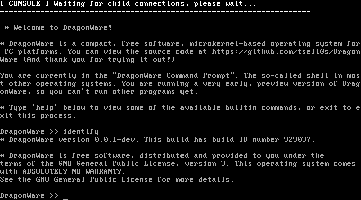
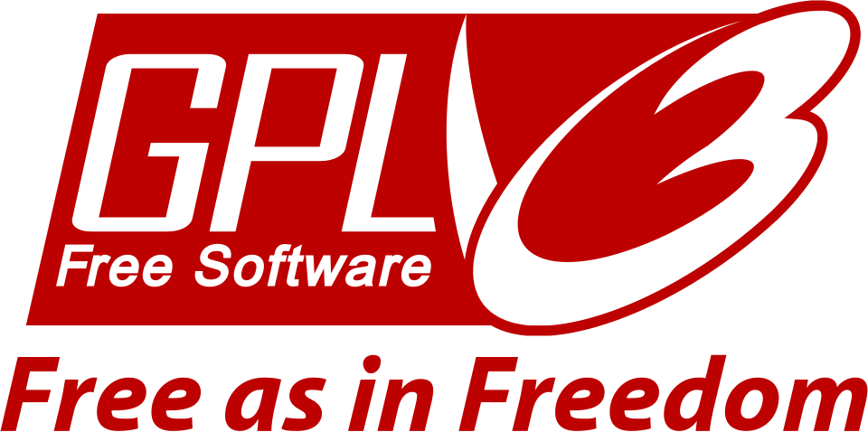

# DragonWare


DragonWare is a microkernel-like, object-based multitasking operating system for the x86 architecture, more specifically IA32 and eventually AMD64. It's designed to be novel, lightweight, modular and stable. It's also completely free and open source, distributed under the GNU General Public License. DragonWare is written in modern C23 and has been greatly inspired by the [architecture of Windows NT](https://en.wikipedia.org/wiki/Architecture_of_Windows_NT) and by [GNU Mach](https://en.wikipedia.org/wiki/GNU_Mach).

This is NOT just a kernel: DragonWare is a full operating system (*Well, not yet complete**d**, but it's getting there*). It aims to provide everything you'd expect from your minimal GNU/Linux distribution, or FreeBSD, right after installing them, from the bootloader to the kernel and text editor and everything in between. It is also NOT a Unix or Windows clone: It's designed from scratch and has a different philosophy and way of doing things.

<div align="center">
        <br>
        
        <br>
        <h6>
                <small><i>
                DragonWare v0.0.1 running inside Bochs.
                </i></small>
        </h6>
</div>

> [!CAUTION]
> ⚠️ DragonWare is in alpha state. You may notice bugs or missing features, random crashes, and even system freezes. Please report any problems you run into [here](https://github.com/tseli0s/DragonWare/issues). Remember that DragonWare comes with ZERO WARRANTY and the authors are not responsible for any damage to your computer!

# Name
Dragon is taken from a [chess opening](https://en.wikipedia.org/wiki/Sicilian_Defence,_Dragon_Variation), the **Dragon Variation of the Sicilian Defense**. The opening is known for being super ambitious but extremely risky and provocative, matching the large ambitions of the DragonWare operating system. The -ware suffix is common in the computing industry (See *software, hardware*), meaning "made out of". The name is not related to the Japanese porcelain stuff decorated with dragons (I learnt of their existence a few months after settling on the name).

# Building DragonWare
DragonWare uses [CMake](https://cmake.org) as its build system, and is usually built with the [`gcc`](https://gcc.gnu.org) compiler (There is also experimental support for `clang`, see below). [`nasm`](https://nasm.us) is used for the assembly-written parts of DragonWare, so it must be installed too (See below for instructions). Finally, to generate an ISO file, `xorriso` must also be installed.

You must first build a cross toolchain that allows DragonWare to run in 32 bit machines. A good article that explains in detail how to build `gcc` to compile operating systems can be found [here](https://wiki.osdev.org/GCC_Cross-Compiler). You must build both binutils and GCC with `i686-elf` as the `$TARGET` (Or `i386-elf` for older, pre-Pentium II hardware support).

If building GCC is not possible, DragonWare also supports being compiled with `clang`. When calling `cmake`, specify `-DUSE_CLANG_COMPILER=ON` in the command line and the toolchain will be automatically selected. Most Linux distributions have `clang` in their repositories as a package, and FreeBSD ships it by default in its base system. Make sure it is installed before proceeding.

Other build dependencies can be installed either from their sites or, if you use GNU/Linux or FreeBSD, by using your system's package manager:
### Debian/Ubuntu
```sh
$ sudo apt update && sudo apt install nasm cmake xorriso
```

### Arch Linux (and derivatives);
```sh
$ sudo pacman -S nasm cmake xorriso
```

### Fedora Linux
```sh
$ sudo dnf install nasm cmake xorriso
```

### FreeBSD
```sh
$ sudo pkg install nasm cmake xorriso
```

Building with CMake is trivial, simply specify the directory where the binaries will be built and build everything in there (The process takes about 10-30 seconds, so don't worry about the `--target everything` part):
```sh
# USE_CLANG_COMPILER -> Whether to use the LLVM toolchain to build DragonWare
# CMAKE_BUILD_TYPE -> Whether to build DragonWare for debugging or to optimize it (Release=Maximum optimization)
# LEGACY_SUPPORT -> Whether to include support for older machines (Pre-Pentium II)
$ cmake . -B build -DUSE_CLANG_COMPILER=OFF -DCMAKE_BUILD_TYPE=Release -DLEGACY_SUPPORT=OFF && cmake --build build/ --target everything
```
There will be an output file called `bootcd.iso` copied when the build finishes in the same directory as the source code. That is a bootable ISO file that, when booted, will drop you to a live DragonWare environment. For everybody's convenience, there is a script that creates a virtual machine and runs DragonWare in it using QEMU. It can be found under [tools/run-qemu.py](./tools/run-qemu.py). Run it with `--help` to learn more about it. 

# Binary Releases
For those who just want "something to boot and run", there are [nightly autogenerated releases of DragonWare](https://github.com/tseli0s/DragonWare/releases) through GitHub Workflows. Note that these are not formal versions and go through zero testing. Simply download the bootcd.iso file and write it in a CD/DVD (or, if you're using a virtual machine, just attach the file there). Note that the bootloader may not work on all hardware configurations when it comes to booting from CDs/USBs, as it doesn't implement `isohybrid` booting support yet.

# Source Code Tree Structure
```
.assets/        -> Image assets, not part of the OS itself
.github/        -> GitHub configuration files for the repository
base/           -> Base userland and microkernel servers
bootmanager/    -> DragonWare Boot Manager, bootloader for DragonWare
cfg/            -> Generic configuration files
cmake/          -> CMake Build System scripts and toolchains
dwuser/         -> DragonWare User Library, providing abstracted APIs to programs
freestanding/   -> Shared code for supervisor components of DragonWare
libc/           -> Standard C library implementation
sys/            -> DragonWare kernel implementation
tools/          -> Debugging and testing scripts
.clang-format   -> clang-format configuration file
.clang-tidy     -> clang-tidy configuration file
.gitignore      -> Files that are automatically ignored by git
CMakeLists.txt  -> OS build script for CMake
COPYING         -> License terms under which DragonWare is distributed
README.md       -> This file
```

# FAQ
- ***Why 32 bit first? Isn't AMD64 the future?***
- It's a little easier to do IA32 first, but AMD64 is also planned. Since most of DragonWare is written in C, only a small part of the codebase will have to be updated. Plus, I like making software work with as many machines as possible, so IA32 is fine.
- ***Why not Unix?***
- Don't get me wrong, I love Unix and I use FreeBSD myself, but I grew bored of all the hobby OSes being Unix clones. I saw very few hobbyists actually get inspired by other operating systems than Unix, and I found Windows NT to be nicer in this aspect (Especially the NT objects system).
- ***Does it support (x)?***
- DragonWare should be able to boot on any >2000s machine with a BIOS/CSM implementation, a VGA compatible graphics card and an x86 CPU. At least in text mode. Graphics drivers for even older GPUs are planned, but a bit harder to make them work as of now due to sparse availability. DragonWare should work with even older machines, by using a compiler that targets the i386 CPU.
- ***What programs can it run?***
- Pretty much whatever is shipped by default. Actually, at the moment, the bootloader must load all programs, because there's no disk driver or filesystem support implemented. A POSIX interface is planned to support some GNU software and everything else has to be ported by hand.
- ***Is it a true microkernel?***
- It does violate some principles of a pure microkernel, by embedding memory management and (partial) device management into the kernel. You can call it a hybrid kernel if you want ([***even though that's pure marketing....***](https://www.realworldtech.com/forum/?threadid=65915&curpostid=65936)). But almost everything else is in userspace. That was my way of working around the fact that most device probing/interrupt handling is sent to the kernel, not user programs.
- ***Does it run DOOM?***
- Not yet. But it's planned and not as far off as you might think. The major roadblock is loading programs from disk (see above), and the rest should be easy. Also, modesetting in userspace requires some kernel support to work.
- ***Why GPLv3?***
- Why not? Best license there is. GPLv2 was also an idea, but at the end of the day, they're almost the same for me.
- ***Why C23? C99 is more portable***
- Well, most modern compilers support C23 already, and it had some neat features like `_BitInt` and `[[attributes(likethis)]]`. Even though you can get equivalents in older compiler versions, I think the whole prospect of using the latest standard made it even more fun to write all this.
- ***Why not use GRUB?***
- It's too heavy, complicated and crashes on old hardware. We won't use 99% of its features anyways, easier to start from scratch with only the things we WILL use. Though [the boot manager](./bootmanager) is multiboot-compliant, as is the kernel, so you can still use another bootloader if you wish.

# License
DragonWare is distributed under the terms of the GNU General Public License, version 3. Please see [COPYING](./COPYING) for more details, or, in a CD/disk installation of DragonWare, see sys::/LICENSE.txt. The entire operating system aims to be 100% free and open source (as per the [FSF definition](https://www.gnu.org/philosophy/free-sw.en.html)).

DragonWare would not be possible if not for the efforts and contributions of the [free software community](https://fsf.org).

<div>
        
        
</div>
